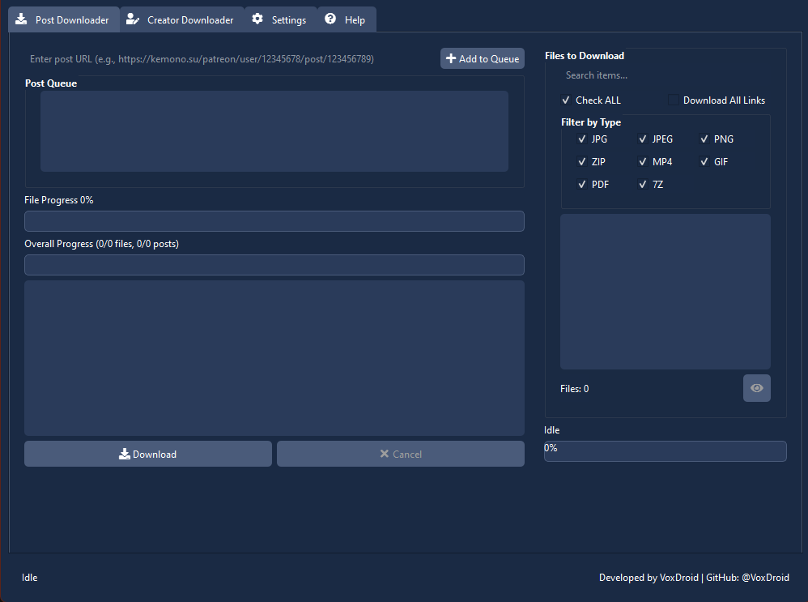
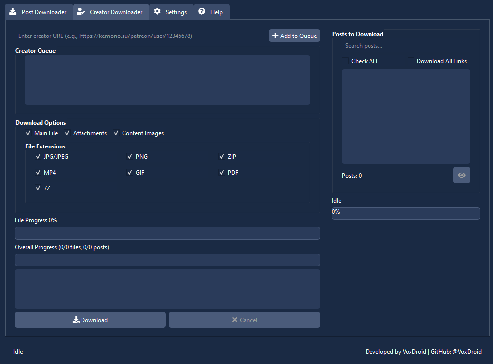
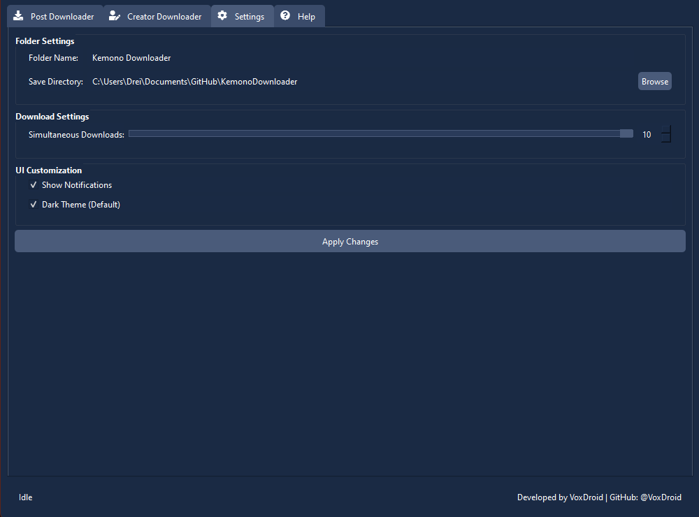

<h1 align="center">Kemono.su Downloader</h1>

<div align="center">
  
</div>

<div align="center">
  <a href="https://github.com/VoxDroid/KemonoDownloader/blob/main/LICENSE">
    
  </a>
  <a href="https://github.com/VoxDroid/KemonoDownloader/releases">
    
  </a>
  <a href="https://github.com/VoxDroid/KemonoDownloader">
    
  </a>
  <a href="https://github.com/VoxDroid/KemonoDownloader/forks">
    
  </a>
  <a href="https://github.com/VoxDroid/KemonoDownloader/commits/main">
    
  </a>
  <a href="https://github.com/VoxDroid/KemonoDownloader/issues">
    
  </a>
  <a href="https://www.python.org/downloads/">
    
  </a>
  <a href="https://github.com/VoxDroid/KemonoDownloader">
    
  </a>
  <a href="https://github.com/VoxDroid/KemonoDownloader/releases">
    
  </a>
  <a>
    
  </a>
  <a href="https://voxdroid.github.io/KemonoDownloader/" target="_blank">
    
</a>
</div>

<br>

<p align="center">
  <a href="https://ko-fi.com/O4O6LO7Q1" target="_blank">
    
  </a>
</p>

<hr style="border: 1px dashed #4A6B9A; margin: 20px 0;">

Welcome to **Kemono Downloader**, a versatile Python-based desktop application built with PyQt6, designed to download content from [Kemono.su](https://kemono.su). This tool enables users to archive individual posts or entire creator profiles from services like Patreon, Fanbox, and more, supporting a wide range of file types with customizable settings and advanced features.

## Table of Contents
- [Features](#features)
- [Installation](#installation)
- [Usage](#usage)
  - [Getting Started](#getting-started)
  - [Post Downloader Tab](#post-downloader-tab)
  - [Creator Downloader Tab](#creator-downloader-tab)
  - [Settings Tab](#settings-tab)
  - [Help Tab](#help-tab)
- [Screenshots](#screenshots)
- [Releases](#releases)
- [Support](#support)
- [Contributing](#contributing)
- [License](#license)
- [Dependencies](#dependencies)

## Features
- **Post Downloading**: Easily download files from specific Kemono.su posts using their URLs.
- **Creator Archiving**: Bulk download all posts and files from a creator's profile with a single click.
- **File Type Support**: Handle images (JPG, PNG, GIF), videos (MP4), archives (ZIP, 7Z), PDFs, and more.
- **Concurrent Downloads**: Adjust the number of simultaneous downloads (1-10) for optimal performance.
- **File Deduplication**: Prevent redundant downloads using URL hashes.
- **Image Previews**: Preview images before downloading to verify content.
- **Detailed Logging**: Track progress and troubleshoot issues with an in-app console.
- **Cross-Platform UI**: Built with PyQt6 for a modern, intuitive interface compatible with multiple operating systems.
- **Media Playback**: Preview videos and GIFs with built-in playback controls (play, pause, seek, volume).
- **Multilingual Support**: Switch between English, Japanese, and Korean languages dynamically.
- **Automatic Updates**: Check for new versions on startup with optional notifications.

## Installation
Kemono Downloader is now packaged using [Briefcase](https://briefcase.readthedocs.io/), making it easier to run or distribute as a native application across platforms. You can either build from source or use pre-compiled binaries where available.

### Building with Briefcase (All Platforms)
1. Ensure you have **Python 3.9+** installed on your system (Windows, macOS, Linux).
2. Clone this repository:
   ```bash
   git clone https://github.com/VoxDroid/KemonoDownloader.git
   cd KemonoDownloader
   ```
3. Install Briefcase and dependencies:
   ```bash
   pip install briefcase
   pip install -r requirements.txt
   ```
4. Initialize the Briefcase project (if not already set up):
   ```bash
   briefcase create
   ```
5. Build the application:
   - **Windows**: `briefcase build windows`
   - **macOS**: `briefcase build macos`
   - **Linux**: `briefcase build linux` 
6. Run the application:
   - **Windows**: `briefcase run windows`
   - **macOS**: `briefcase run macos`
   - **Linux**: `briefcase run linux` 
   - **Note**: An internet connection is required to fetch content from Kemono.su.

### Pre-Compiled Binaries
- **Windows**: Download the latest `.exe` (portable) or `.msi` (installer) tagged with [**`W`**] for windows, from the [Releases page](https://github.com/VoxDroid/KemonoDownloader/releases). Run the msi installer or use the portable version for no-setup runs.
- **macOS**: Download the latest universal `.dmg` (x86_64 and Apple Silicon) tagged with [**`M`**] for MacOS, from the [Releases page](https://github.com/VoxDroid/KemonoDownloader/releases). Open the DMG, drag the app to Applications, and launch it.
- **Linux**: Download the latest `.rpm` (for Fedora/Red Hat), `.deb` (for Debian/Ubuntu), or `.pkg.tar.zst` (for Arch/Pacman) tagged with [**`L`**] for Linux, from the [Releases page](https://github.com/VoxDroid/KemonoDownloader/releases). Run the installer and launch the app.

## Usage
Upon launching, you’ll see an introductory screen with a "Launch" button. Click it to enter the main interface, featuring four tabs: **Post Downloader**, **Creator Downloader**, **Settings**, and **Help**. The in-app Help tab contains a comprehensive user manual.

### Getting Started
- The application creates default directories (`Downloads`, `Cache`, `Other Files`) in the specified save location.
- Ensure an active internet connection to access Kemono.su content.
- Explore the Help tab for detailed instructions and troubleshooting tips.

### Post Downloader Tab
- **Purpose**: Download files from individual Kemono.su posts.
- **How to Use**:
  1. Enter a post URL (e.g., `https://kemono.su/patreon/user/123456789/post/123456789`) in the "Enter post URL" field.
  2. Click "Add to Queue" to add it to the list.
  3. Click the eye icon to view files, filter by type (e.g., JPG, ZIP), and select files to download.
  4. Click "Download" to start, and monitor progress with the progress bars and console.

### Creator Downloader Tab
- **Purpose**: Bulk download content from a creator's profile.
- **How to Use**:
  1. Enter a creator URL (e.g., `https://kemono.su/patreon/user/123456789`) in the "Enter creator URL" field.
  2. Click "Add to Queue" to add it to the list.
  3. Click the eye icon to fetch posts, configure options (Main File, Attachments, Content Images), and select posts.
  4. Click "Download" to begin, and track progress via the interface.

### Settings Tab
- **Purpose**: Customize the application’s behavior.
- **How to Use**:
  1. Set the folder name and save directory for downloads.
  2. Adjust simultaneous downloads (1-10) using the slider or spinbox.
  3. Click "Apply Changes" to save.

### Help Tab
- **Purpose**: Access the embedded user manual.
- **How to Use**: Navigate to the Help tab to read detailed guides, examples, and support information.

## Screenshots

Here are previews of the main tabs in Kemono Downloader:

<table align="center">
  <tr>
    <td align="center">
      
      <br>
      <strong>Post Downloader Tab</strong>
    </td>
    <td align="center">
      
      <br>
      <strong>Creator Downloader Tab</strong>
    </td>
  </tr>
  <tr>
    <td align="center">
      
      <br>
      <strong>Settings Tab</strong>
    </td>
    <td align="center">
      <!-- Placeholder for potential fourth screenshot -->
    </td>
  </tr>
</table>

## Releases
- **Windows**: Pre-compiled `.exe` available in the [Releases section](https://github.com/VoxDroid/KemonoDownloader/releases).
- **macOS**: Pre-compiled universal `.dmg` (x86_64 and Apple Silicon) available in the [Releases section](https://github.com/VoxDroid/KemonoDownloader/releases).
- **Linux**: Pre-compiled `.rpm` (for Fedora/Red Hat), `.deb` (for Debian/Ubuntu), or `.pkg.tar.tsz` (for Arch/Pacman) available in the [Releases page](https://github.com/VoxDroid/KemonoDownloader/releases).
- Check release notes for details on new features, bug fixes, and version updates.
- The Briefcase-built Python source remains the primary method, supporting all platforms with proper setup.

## Support
If you enjoy this project or want to support its development, consider these options:

- **Ko-fi**: Buy me a coffee to fuel further development! Visit: [https://ko-fi.com/izeno](https://ko-fi.com/izeno).
- **GitHub Issues**: Report bugs or suggest features on the [Issues page](https://github.com/VoxDroid/KemonoDownloader/issues).
- **Discussions**: Engage with the community on the [Discussions tab](https://github.com/VoxDroid/KemonoDownloader/discussions) for support and ideas.

## Contributing
Kemono Downloader is open-source, and contributions are encouraged! Here’s how to get involved:
1. Fork the repository: [https://github.com/VoxDroid/KemonoDownloader](https://github.com/VoxDroid/KemonoDownloader).
2. Create a branch for your feature or fix.
3. Submit a pull request with a clear description of your changes.
4. Adhere to coding standards (to be detailed in a future `CONTRIBUTING.md`).
5. Test your changes thoroughly before submission.

## License
This project is licensed under the [MIT License](LICENSE). Use, modify, and distribute it freely per the license terms.

## Dependencies
To build from source, install the following Python packages:
- `PyQt6` (for the GUI)
- `requests` (for HTTP requests)
- `beautifulsoup4` (for HTML parsing)
- `qtawesome` (for icons)
- `briefcase` (for packaging the app)

Create a `requirements.txt` file with these dependencies and run `pip install -r requirements.txt`.

---

**Developed by VoxDroid**  
[GitHub](https://github.com/VoxDroid) | [Ko-fi](https://ko-fi.com/izeno)

---
